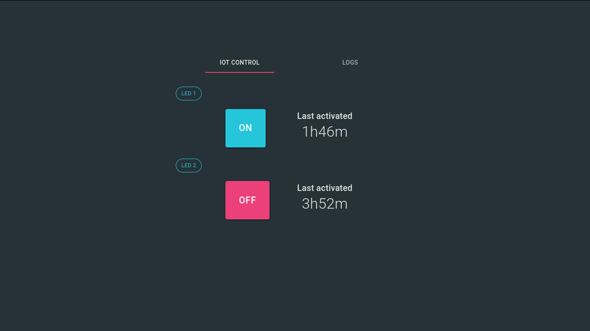

# LED Control using NodeMCU via Web

    

This is a web for controlling LED that connected to NodeMCU using REST API.

### Requirements

* [NodeJS](https://nodejs.org/en/) v12+ or [Yarn](https://classic.yarnpkg.com/en/docs/install) v1.20+

### How To Use

1. Clone/Download the repo
2. Go to downloaded repo then run `npm i` or `yarn`
3. Rename **.env.example** file to **.env**
4. Add the `REACT_APP_API_HOSTNAME` value with your API HOST, *example: REACT_APP_API_HOSTNAME=http://localhost:5550/*
5. Run `npm run dev` or `yarn dev` to run development server
